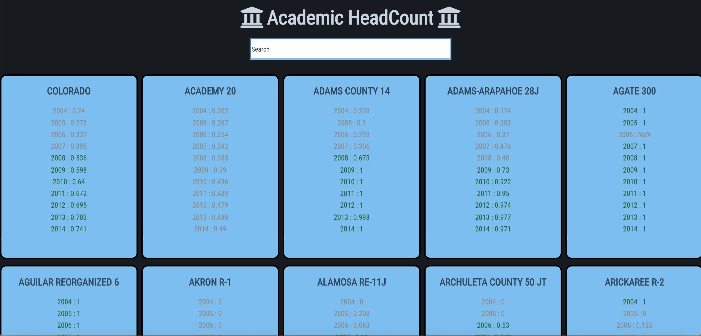

# HeadCount 2.0

HeadCount 2.0 is a project designed to challenge my skills at manipulating data and creating small, reusable React components.
- Filter cards by search
- Find the Average of a School clicked
- Can compare averages between two schools chosen

This application was built using the `create-react-app` boilerplate. 
